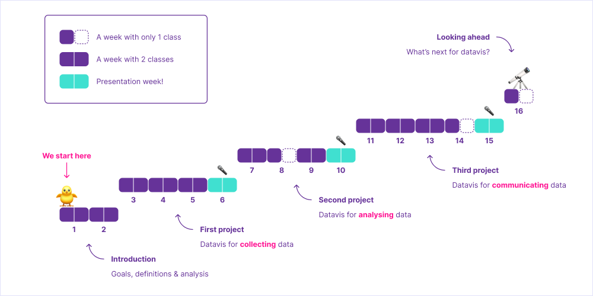
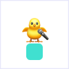
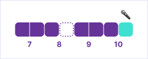
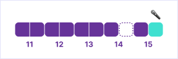
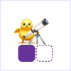

# Syllabus — Advanced Infographics and Data Visualization

This is the main document for the JMM 429/629 course at University of Miami, Fall 2022.

🗓 Classes on Tuesdays and Thursdays, from `3:30` to `4:45 pm`.

Last updated on Aug 22, 2022. This document is subject to change.

## About the Course

This course is a seminar designed to introduce interactive data visualization concepts in a web environment. Students will be introduced to code libraries which assist in this task, best practices for interactivity and data visualization. The course will also briefly cover working with data (i.e., how to find sources, cleaning and preparing data for visualizations, etc).

### Course Goals

By the end of this course, students should be able to:

- Design and code their own custom data visualizations
- Identify (and avoid) misleading statistics and charts
- Apply data visualization principles to their own fields

### Course Topics

In order to reach the desired goals, students will learn how data visualization may be employed during all phases of a project:

- Collecting (using visuals to gather data)
- Analyzing (using visuals to find insights)
- Communicating (using visuals to tell stories)

Since this is a practical course focused on a web environment, we will also learn about the following core technologies:

- 🧱 [HTML](https://developer.mozilla.org/en-US/docs/Learn/Getting_started_with_the_web/HTML_basics) (to define structure and content)
- 🎨 [CSS](https://developer.mozilla.org/en-US/docs/Learn/Getting_started_with_the_web/CSS_basics) (to apply visual styles)
- ✨ [JS](https://developer.mozilla.org/en-US/docs/Learn/Getting_started_with_the_web/JavaScript_basics) (to turn data into [visual variables](https://en.wikipedia.org/wiki/Visual_variable))

This course also covers tools that help us organize and scale up our projects:

- [D3](https://d3js.org/) (to easily create scales)
- [MapBox](https://www.mapbox.com/mapbox-studio/) (to easily create maps)

All tools are free (or provide a free version).

### Course Timeline

We will not learn everything at once. Instead, this 16-week course is split into 5 steps. Each step builds on top of what we learned from the previous one. Here is what this progression looks like:



After a couple of weeks of introduction, students begin working on projects. There are 3 individual projects (of increasing complexity) – and students will have around 3 weeks to create each one of them, from idea to coding.

#### Presentation day

At the end of each project step, we have **presentation day** – imagine this to be you 3× during the semester:



On presentation day, the class will be dedicated to presentation and discussion of projects. Each student has about 10 minutes to present their project and get feedback.

After the presentation, students are free to adjust the project (based on that feedback) and submit it for grading (prior to the beginning of the first class of the following week).

### Course Content

The following tables briefly describe what we will be doing during class (“Content”) and what you are expected to do before each class (“Preparation”).

#### Introduction


<table>
    <tr>
        <th>Week</th>
        <th>Weekday</th>
        <th>Date</th>
        <th>Preparation</th>
        <th>Content</th>
    </tr>
    <tr>
        <td rowspan=2>1</td>
        <td>Tue</td>
        <td>Aug 23</td>
        <td></td>
        <td>Discussing course goals, topics, tools, timeline & grading</td>
    </tr>
    <tr>
        <td>Thu</td>
        <td>Aug 25</td>
        <td>
            <!--
            Watch <a href="https://youtu.be/YoXxevp1WRQ?t=313">this</a>, from <code>5:13</code> to <code>41:54</code>, to learn how computers cleverly represent numbers, text, color, images & even emoji
            <br><br>
            -->
            Watch <a href="https://www.youtube.com/watch?v=3L8SzEtfQKE">this</a> for a practical introduction to visual variables
        </td>
        <td>
            Creating an input visualization & demystifying basic statistic concepts
        </td>
    </tr>
    <tr>
        <td rowspan=2>2</td>
        <td>Tue</td>
        <td>Aug 30</td>
        <td>
            Watch <a href="https://youtu.be/5g0x2xv3aHU?t=3155">this</a> to better understand the potential of HTML & CSS
            <br><br>
            Sign up for <a href="https://codesandbox.io/">CodeSandbox</a>
        </td>
        <td>Coding a simple data visualization with HTML & CSS</td>
    </tr>
    <tr>
        <td>Thu</td>
        <td>Sep 1</td>
        <td>Pick a datavis you saw recently</td>
        <td>Analyzing examples & discussing improvements</td>
    </tr>
</table>

##### Assignment: 🔍 Analysis 
```
Pick a data visualization you saw recently. It could be in:

• A news article (like a line chart)
• A game (like a score indicator)
• A video (like a social media post)
• An app (like health metrics)
• Or anywhere else (like an installation in a science museum)

Submit the following:

• 📱 Screen capture, photos or recording
• URL (https://example.com)
• What is its goal?
• Why did you pick it?
• How could it be improved?

Due Sep 6, via Blackboard.
```

#### First Project: Input Visualization
*Datavis for collecting data*


<table>
    <tr>
        <th>Week</th>
        <th>Weekday</th>
        <th>Date</th>
        <th>Preparation</th>
        <th>Content</th>
    </tr>
    <tr>
        <td rowspan=2>3</td>
        <td>Tue</td>
        <td>Sep 6</td>
        <td>
            Watch <a href="https://www.youtube.com/watch?v=qfF4Pj3XJKA">this</a> or read <a href="http://hdl.handle.net/1880/114011">this</a> to learn more about “input visualizations”
        </td>
        <td>
            Presenting project goals, deliveries and due dates
            <br><br>
            Discussing input visualization examples
        </td>
    </tr>
    <tr>
        <td>Thu</td>
        <td>Sep 8</td>
        <td>Watch <a href="https://youtu.be/5g0x2xv3aHU?t=6774">this</a>, from <code>1:50:50</code> to <code>2:25:40</code>, to learn the basics of JavaScript</td>
        <td>Coding a simple input visualization with HTML, CSS & JS</td>
    </tr>
    <tr>
        <td rowspan=2>4</td>
        <td>Tue</td>
        <td>Sep 13</td>
        <td>Plan your project</td>
        <td>Translating your idea into code</td>
    </tr>
    <tr>
        <td>Thu</td>
        <td>Sep 15</td>
        <td></td>
        <td>Translating your idea into code</td>
    </tr>
    <tr>
        <td rowspan=2>5</td>
        <td>Tue</td>
        <td>Sep 20</td>
        <td>Take note of 1-3 tasks you need help with</td>
        <td>Pairing up with classmates to help each other (instructor may intervene)</td>
    </tr>
    <tr>
        <td>Thu</td>
        <td>Sep 22</td>
        <td></td>
        <td>Pairing up with classmates to help each other (instructor may intervene)</td>
    </tr>
    <tr>
        <td rowspan=2>6</td>
        <td>Tue</td>
        <td>Sep 27</td>
        <td></td>
        <td></td>
    </tr>
    <tr>
        <td>Thu</td>
        <td>Sep 29</td>
        <td></td>
        <td>Presenting your work & getting feedback</td>
    </tr>
</table>

##### Assignment: ✏️ Planning
```
Plan your project:

• What is its purpose?
• What is its content?
• What could it look like?

Due Sep 13, via Blackboard.
```

##### Assignment: 🎤 Presentation
```
Present your project:

• Up to 10 minutes

Due Sep 29, during class.
```

##### Assignment: 💻 Submission
```
Submit your project:

• URL
• Screen capture or recording
• Paragraph describing what you would have done differently – and why

Due Oct 4, via Blackboard.
```

#### Second Project: Exploratory Visualization
*Datavis for analyzing data*



<table>
    <tr>
        <th>Week</th>
        <th>Weekday</th>
        <th>Date</th>
        <th>Preparation</th>
        <th>Content</th>
    </tr>
    <tr>
        <td rowspan=2>7</td>
        <td>Tue</td>
        <td>Oct 4</td>
        <td></td>
        <td>
            Presenting project goals, deliveries and due dates
            <br><br>
            Discussing the value of graphics during exploratory analysis
        </td>
    </tr>
    <tr>
        <td>Thu</td>
        <td>Oct 6</td>
        <td></td>
        <td>Coding a histogram and a scatter plot</td>
    </tr>
    <tr>
        <td rowspan=2>8</td>
        <td>Tue</td>
        <td>Oct 11</td>
        <td>Plan your project</td>
        <td>Translating your idea into code</td>
    </tr>
    <tr>
        <td>Thu</td>
        <td>Oct 13</td>
        <td></td>
        <td>🚫 No class</td>
    </tr>
    <tr>
        <td rowspan=2>9</td>
        <td>Tue</td>
        <td>Oct 18</td>
        <td>Take note of 1-3 tasks you need help with</td>
        <td>Pairing up with classmates to help each other (instructor may intervene)</td>
    </tr>
    <tr>
        <td>Thu</td>
        <td>Oct 20</td>
        <td></td>
        <td>Pairing up with classmates to help each other (instructor may intervene)</td>
    </tr>
    <tr>
        <td rowspan=2>10</td>
        <td>Tue</td>
        <td>Oct 25</td>
        <td></td>
        <td></td>
    </tr>
    <tr>
        <td>Thu</td>
        <td>Oct 27</td>
        <td></td>
        <td>Presenting your work & getting feedback</td>
    </tr>
</table>

##### Assignment: ✏️ Planning
```
Plan your project:

• What is its purpose?
• What is its content?
• What could it look like?

Due Oct 11, via Blackboard.
```

##### Assignment: 🎤 Presentation
```
Present your project:

• Up to 10 minutes

Due Oct 27, during class.
```

##### Assignment: 💻 Submission
```
Submit your project:

• URL
• Screen capture or recording
• Paragraph describing what you would have done differently – and why

Due Nov 1, via Blackboard.
```

#### Third Project: Explanatory Visualization
*Datavis for communicating data*



<table>
    <tr>
        <th>Week</th>
        <th>Weekday</th>
        <th>Date</th>
        <th>Preparation</th>
        <th>Content</th>
    </tr>
    <tr>
        <td rowspan=2>11</td>
        <td>Tue</td>
        <td>Nov 1</td>
        <td>
        </td>
        <td>
            Presenting project goals, deliveries and due dates
            <br><br>
            Discussing exploratory & explanatory approaches
        </td>
    </tr>
    <tr>
        <td>Thu</td>
        <td>Nov 3</td>
        <td></td>
        <td>Coding a step-by-step visual narrative</td>
    </tr>
    <tr>
        <td rowspan=2>12</td>
        <td>Tue</td>
        <td>Nov 8</td>
        <td>Plan your project</td>
        <td>Translating your idea into code</td>
    </tr>
    <tr>
        <td>Thu</td>
        <td>Nov 10</td>
        <td></td>
        <td>Translating your idea into code</td>
    </tr>
    <tr>
        <td rowspan=2>13</td>
        <td>Tue</td>
        <td>Nov 15</td>
        <td>Take note of 1-3 tasks you need help with</td>
        <td>Pairing up with classmates to help each other (instructor may intervene)</td>
    </tr>
    <tr>
        <td>Thu</td>
        <td>Nov 17</td>
        <td></td>
        <td>Pairing up with classmates to help each other (instructor may intervene)</td>
    </tr>
    <tr>
        <td rowspan=2>14</td>
        <td>Tue</td>
        <td>Nov 22</td>
        <td>Submit a question for online (Zoom) session with instructor</td>
        <td>Answering most common questions from students (Zoom)</td>
    </tr>
    <tr>
        <td>Thu</td>
        <td>Nov 24</td>
        <td></td>
        <td>🚫 No class</td>
    </tr>
    <tr>
        <td rowspan=2>15</td>
        <td>Tue</td>
        <td>Nov 29</td>
        <td></td>
        <td></td>
    </tr>
    <tr>
        <td>Thu</td>
        <td>Dec 1</td>
        <td></td>
        <td>Presenting your work & getting feedback</td>
    </tr>
</table>

##### Assignment: ✏️ Planning
```
Plan your project:

• What is its purpose?
• What is its content?
• What could it look like?

Due Nov 8, via Blackboard.
```

##### Assignment: 🎤 Presentation
```
Present your project:

• Up to 10 minutes

Due Dec 1, during class.
```

##### Assignment: 💻 Submission
```
Submit your project:

• URL
• Screen capture or recording
• Paragraph describing what you would have done differently – and why

Due Dec 6, via Blackboard.
```

#### Looking Ahead


<table>
    <tr>
        <th>Week</th>
        <th>Weekday</th>
        <th>Date</th>
        <th>Preparation</th>
        <th>Content</th>
    </tr>
    <tr>
        <td rowspan=2>16</td>
        <td>Tue</td>
        <td>Dec 6</td>
        <td></td>
        <td>Discussing the future of infographics and data visualization – and paths we can take</td>
    </tr>
    <tr>
        <td>Thu</td>
        <td>Dec 8</td>
        <td></td>
        <td>🚫 No class</td>
    </tr>
</table>

##### Assignment: 🔭 Self-reflection 
```
Submit a self-reflection considering:

• Your experience learning about infographics & data visualization
• How it relates to your future pursuits (personal & professional)

The format could either be:

• Written (up to a page); or
• Video recording (up to 5 minutes)

Feel free to include sketches, photos or any other media.

Due Dec 14, via Blackboard (instead of Final Exam).
```

## Grading

I reserve the right to adjust the final grade according to class participation, attendance, overall
quality of work, etc.

### Grading Breakdown

<table>
    <tr>
        <th>Step</th>
        <th>Assignment</th>
        <th>Points</th>
    </tr>
    <tr>
        <td>Introduction</td>
        <td>🔍 &nbsp;Analysis</td>
        <td>5</td>
    </tr>
    <tr>
        <td rowspan=3>First Project</td>
        <td>✏️ &nbsp;Planning</td>
        <td>10</td>
    </tr>
    <tr>
        <td>🎤 &nbsp;Presentation</td>
        <td>10</td>
    </tr>
    <tr>
        <td>💻 &nbsp;Submission</td>
        <td>10</td>
    </tr>
    <tr>
        <td rowspan=3>Second Project</td>
        <td>✏️ &nbsp;Planning</td>
        <td>10</td>
    </tr>
    <tr>
        <td>🎤 &nbsp;Presentation</td>
        <td>10</td>
    </tr>
    <tr>
        <td>💻 &nbsp;Submission</td>
        <td>10</td>
    </tr>
    <tr>
        <td rowspan=3>Third Project</td>
        <td>✏️ &nbsp;Planning</td>
        <td>10</td>
    </tr>
    <tr>
        <td>🎤 &nbsp;Presentation</td>
        <td>10</td>
    </tr>
    <tr>
        <td>💻 &nbsp;Submission</td>
        <td>10</td>
    </tr>
    <tr>
        <td>Looking ahead</td>
        <td>🔭 &nbsp;Self-reflection</td>
        <td>5</td>
    </tr>
</table>

### Grading Scale

Grade | Points
---|---
A+ | ≥ 97
A | ≥ 93
A- | ≥ 90
B+ | ≥ 87
B | ≥ 83
B- | ≥ 80
C+ | ≥ 77
C | ≥ 70
D+ | ≥ 65
D | ≥ 60
F | ≥ 0

## Office Hours

Students may schedule individual sessions with the instructor. A Calendly link will be made available with specific time slots for online (Zoom) meetings.

## Policies

### Religious Holy Day Policy

It is the student’s obligation to provide faculty members with notice of the dates they will be absent for religious holy days. Students are responsible for material covered in class regardless of their presence. The University’s complete Religious Holy Day Policy can be found in the current Bulletin.

### Attendance Policy
Class attendance is critical to the success of this hands-on class, including class participation in discussions and completion of in-class assignments. All students are responsible for material covered in the classroom regardless of their presence; therefore, check the Blackboard class for announcements and assignment requirements and due dates. Do not email your instructor to find out what has been posted to Blackboard. Late work will not be accepted unless an extension has formally been requested prior to the deadline and approved on a needs only basis. 

### Recording Policy
Students are expressly prohibited from recording any part of this course. If any recordings are available to students they are intended to supplement the classroom experience. Students are expected to follow appropriate University policies and maintain the security of passwords used to access recorded lectures. Recordings may not be reproduced, shared with those not in the class, or uploaded to other online environments.

If the instructor or a University of Miami office plans any other uses for the recordings, beyond this class, students identifiable in the recordings will be notified to request consent prior to such use. Instructors are the copyright owner of the courseware; individual recordings of the materials on Blackboard or Microsoft Teams and/or of the virtual sessions are not allowed; and that such materials cannot be shared outside the physical or virtual classroom environment. 

### Honor Code & Plagiarism Statements

Students enrolled in this course are expected to abide by the University of Miami Honor Code. The purpose of the Honor Code is to protect the academic integrity of the University by encouraging consistent ethical behavior in assigned coursework. Academic dishonesty of any kind, for whatever reason, will not be tolerated. 

No honest student wants to be guilty of the intellectual crime of plagiarism, even unintentionally. Therefore, we provide you with these guidelines so that you don’t accidentally fall into the plagiarism trap. 

Plagiarism is the taking of someone else’s words, work, or ideas, and passing them off as a product of your own efforts. Plagiarism may occur when a person fails to place quotation marks around someone else’s exact words, directly rephrasing or paraphrasing someone else’s words while still following the general form of the original, and/or failing to issue the proper citation to one’s source material. 

In student papers, plagiarism is often due to: 

- Turning in someone else’s paper as one’s own 
- Using another person’s data or ideas without acknowledgment 
- Failing to cite a written source (printed or internet) of information that you used to collect data or ideas 
- Copying an author’s exact words and putting them in the paper without quotation marks 
- Rephrasing an author’s words and failing to cite the source 
- Copying, rephrasing, or quoting an author’s exact words and citing a source other than where the material was obtained.
- Using wording that is very similar to that of the original source, but passing it off as one’s own. 

The last item is probably the most common problem in student writing. It is still plagiarism if students use an author’s key phrases or sentences in a way that implies they are their own, even if they cite the source. 

### Well-Being Resources & Support

As you complete your coursework, consider how you can maintain your health and well-being as a top priority. To help you become familiar with the many programs and services available on campus, review the information collected on the Student Well-Being and Resiliency website available at [miami.edu/well-being](https://miami.edu/well-being). 

Please reach out to me or any of the resources listed on the site if you need assistance or support throughout the semester. 