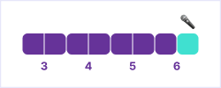

# Syllabus — Advanced Infographics and Data Visualization

This is the main document for the JMM 429/629 course at University of Miami, Fall 2022.

🗓 Classes on Tuesdays and Thursdays, from `3:30` to `4:45 pm`.

## About the Course

This course is a seminar designed to introduce interactive data visualization concepts in a web environment. Students will be introduced to code libraries which assist in this task, best practices for interactivity and data visualization. The course will also briefly cover working with data (i.e., how to find sources, cleaning and preparing data for visualizations, etc).

### Course Goals

By the end of this course, students should be able to:

- …
- …
- …

### Course Topics

In order to reach the desired goals, students will learn …:

- …
- …
- …

This course also covers tools that help us organize and scale up our projects:

- …
- …
- …

All tools are free (or provide a free version).

### Course Timeline

We will not learn everything at once. Instead, this 16-week course is split into 5 steps. Each step builds on top of what we learned from the previous one. Here is what this progression looks like:


After a couple of weeks of introduction, students begin working on projects. There are 3 individual projects (of increasing complexity) – and students will have around 3 weeks to create each one of them, from ideation to coding.

#### Presentation week

At the end of each project step, we have **presentation week** – imagine this to be you 3× during the semester:


On presentation week, both classes of that week will be dedicated to presentation and discussion of projects. Half of the students present on … and half on …. Each student has about 5 minutes to present their project and get feedback.

After the presentation, students are free to adjust the project (based on that feedback) and submit it for grading (prior to the beginning of the first class of the following week).

### Course Content

#### Introduction


<table>
    <tr>
        <th>Week</th>
        <th>Weekday</th>
        <th>Date</th>
        <th>Preparation</th>
        <th>Content</th>
    </tr>
    <tr>
        <td rowspan=2>1</td>
        <td>Tue</td>
        <td>Aug 23</td>
        <td></td>
        <td></td>
    </tr>
    <tr>
        <td>Thu</td>
        <td>Aug 25</td>
        <td></td>
        <td></td>
    </tr>
    <tr>
        <td rowspan=2>2</td>
        <td>Tue</td>
        <td>Aug 30</td>
        <td></td>
        <td></td>
    </tr>
    <tr>
        <td>Thu</td>
        <td>Sep 1</td>
        <td></td>
        <td></td>
    </tr>
</table>

##### Assignment: 🔍 Analysis 
```
Pick a …. Submit the following:

• 📱 Screen capture or recording
• URL (https://example.com)
• …
• …
• …

Due Sep 6, via Blackboard.
```

#### First Project: Datavis for Collecting Data


<table>
    <tr>
        <th>Week</th>
        <th>Weekday</th>
        <th>Date</th>
        <th>Preparation</th>
        <th>Content</th>
    </tr>
    <tr>
        <td rowspan=2>3</td>
        <td>Tue</td>
        <td>Sep 6</td>
        <td></td>
        <td></td>
    </tr>
    <tr>
        <td>Thu</td>
        <td>Sep 8</td>
        <td></td>
        <td></td>
    </tr>
    <tr>
        <td rowspan=2>4</td>
        <td>Tue</td>
        <td>Sep 13</td>
        <td></td>
        <td></td>
    </tr>
    <tr>
        <td>Thu</td>
        <td>Sep 15</td>
        <td></td>
        <td></td>
    </tr>
    <tr>
        <td rowspan=2>5</td>
        <td>Tue</td>
        <td>Sep 20</td>
        <td></td>
        <td></td>
    </tr>
    <tr>
        <td>Thu</td>
        <td>Sep 22</td>
        <td></td>
        <td></td>
    </tr>
    <tr>
        <td rowspan=2>6</td>
        <td>Tue</td>
        <td>Sep 27</td>
        <td></td>
        <td></td>
    </tr>
    <tr>
        <td>Thu</td>
        <td>Sep 29</td>
        <td></td>
        <td></td>
    </tr>
</table>

##### Assignment: ✏️ Planning
```
Plan your …:

• …?
• …?
• …?

Due Sep 13, via Blackboard.
```

##### Assignment: 🎤 Presentation
```
Present your project:

• Up to 5 minutes

Due Sep 27 or 29, during class.
```

##### Assignment: 💻 Submission
```
Submit your project:

• URL
• Screen capture or recording
• Paragraph describing what you would have done differently – and why

Due Oct 4, via Blackboard.
```


#### Second Project: Datavis for Analyzing Data


<table>
    <tr>
        <th>Week</th>
        <th>Weekday</th>
        <th>Date</th>
        <th>Preparation</th>
        <th>Content</th>
    </tr>
    <tr>
        <td rowspan=2>7</td>
        <td>Tue</td>
        <td>Oct 4</td>
        <td></td>
        <td></td>
    </tr>
    <tr>
        <td>Thu</td>
        <td>Oct 6</td>
        <td></td>
        <td></td>
    </tr>
    <tr>
        <td rowspan=2>8</td>
        <td>Tue</td>
        <td>Oct 11</td>
        <td></td>
        <td></td>
    </tr>
    <tr>
        <td>Thu</td>
        <td>Oct 13</td>
        <td></td>
        <td>🚫 No class</td>
    </tr>
    <tr>
        <td rowspan=2>9</td>
        <td>Tue</td>
        <td>Oct 18</td>
        <td></td>
        <td></td>
    </tr>
    <tr>
        <td>Thu</td>
        <td>Oct 20</td>
        <td></td>
        <td></td>
    </tr>
    <tr>
        <td rowspan=2>10</td>
        <td>Tue</td>
        <td>Oct 25</td>
        <td></td>
        <td></td>
    </tr>
    <tr>
        <td>Thu</td>
        <td>Oct 27</td>
        <td></td>
        <td></td>
    </tr>
</table>

##### Assignment: ✏️ Planning
```
Plan your project:

• …?
• …?
• …?

Due ___, via Blackboard.
```

##### Assignment: 🎤 Presentation
```
Present your project:

• Up to 5 minutes

Due ___ or ___, during class.
```

##### Assignment: 💻 Submission
```
Submit your project:

• URL
• Screen capture or recording
• Paragraph describing what you would have done differently – and why

Due ___, via Blackboard.
```

#### Third Project: Datavis for Communicating Data


<table>
    <tr>
        <th>Week</th>
        <th>Weekday</th>
        <th>Date</th>
        <th>Preparation</th>
        <th>Content</th>
    </tr>
    <tr>
        <td rowspan=2>11</td>
        <td>Tue</td>
        <td>Nov 1</td>
        <td></td>
        <td></td>
    </tr>
    <tr>
        <td>Thu</td>
        <td>Nov 3</td>
        <td></td>
        <td></td>
    </tr>
    <tr>
        <td rowspan=2>12</td>
        <td>Tue</td>
        <td>Nov 8</td>
        <td></td>
        <td></td>
    </tr>
    <tr>
        <td>Thu</td>
        <td>Nov 10</td>
        <td></td>
        <td></td>
    </tr>
    <tr>
        <td rowspan=2>13</td>
        <td>Tue</td>
        <td>Nov 15</td>
        <td></td>
        <td></td>
    </tr>
    <tr>
        <td>Thu</td>
        <td>Nov 17</td>
        <td></td>
        <td></td>
    </tr>
    <tr>
        <td rowspan=2>14</td>
        <td>Tue</td>
        <td>Nov 22</td>
        <td></td>
        <td></td>
    </tr>
    <tr>
        <td>Thu</td>
        <td>Nov 24</td>
        <td></td>
        <td>🚫 No class</td>
    </tr>
    <tr>
        <td rowspan=2>15</td>
        <td>Tue</td>
        <td>Nov 29</td>
        <td></td>
        <td></td>
    </tr>
    <tr>
        <td>Thu</td>
        <td>Dec 1</td>
        <td></td>
        <td></td>
    </tr>
</table>

##### Assignment: ✏️ Planning
```
Plan your project:

• …?
• …?
• …?

Due ___, via Blackboard.
```

##### Assignment: 🎤 Presentation
```
Present your project:

• Up to 5 minutes

Due ___ or ___, during class.
```

##### Assignment: 💻 Submission
```
Submit your project:

• URL
• Screen capture or recording
• Paragraph describing what you would have done differently – and why

Due ___, via Blackboard.
```

#### Looking Ahead


<table>
    <tr>
        <th>Week</th>
        <th>Weekday</th>
        <th>Date</th>
        <th>Preparation</th>
        <th>Content</th>
    </tr>
    <tr>
        <td rowspan=2>16</td>
        <td>Tue</td>
        <td>Dec 6</td>
        <td></td>
        <td></td>
    </tr>
    <tr>
        <td>Thu</td>
        <td>Dec 8</td>
        <td></td>
        <td>🚫 No class</td>
    </tr>
</table>

##### Assignment: 🔭 Self-reflection 
```
…

Due ___, via Blackboard.
```

## Grading

I reserve the right to adjust the final grade according to class participation, attendance, overall quality of work, etc.

### Grading Breakdown

<table>
    <tr>
        <th>Step</th>
        <th>Assignment</th>
        <th>Points</th>
    </tr>
    <tr>
        <td>Introduction</td>
        <td>🔍 &nbsp;Analysis</td>
        <td>5</td>
    </tr>
    <tr>
        <td rowspan=3>First Project</td>
        <td>✏️ &nbsp;Planning</td>
        <td>10</td>
    </tr>
    <tr>
        <td>🎤 &nbsp;Presentation</td>
        <td>10</td>
    </tr>
    <tr>
        <td>💻 &nbsp;Submission</td>
        <td>10</td>
    </tr>
    <tr>
        <td rowspan=3>Second Project</td>
        <td>✏️ &nbsp;Planning</td>
        <td>10</td>
    </tr>
    <tr>
        <td>🎤 &nbsp;Presentation</td>
        <td>10</td>
    </tr>
    <tr>
        <td>💻 &nbsp;Submission</td>
        <td>10</td>
    </tr>
    <tr>
        <td rowspan=3>Third Project</td>
        <td>✏️ &nbsp;Planning</td>
        <td>10</td>
    </tr>
    <tr>
        <td>🎤 &nbsp;Presentation</td>
        <td>10</td>
    </tr>
    <tr>
        <td>💻 &nbsp;Submission</td>
        <td>10</td>
    </tr>
    <tr>
        <td>Looking ahead</td>
        <td>🔭 &nbsp;Self-reflection</td>
        <td>5</td>
    </tr>
</table>

### Grading Scale

Grade | Points
---|---
A+ | 100
A | ≥ 95
A- | ≥ 90
B+ | ≥ 87
B | ≥ 84
B- | ≥ 80
C+ | ≥ 77
C | ≥ 74
C- | ≥ 70
D+ | ≥ 67
D | ≥ 60
F | ≥ 0

## Office Hours

TBA

## Policies

### Religious Holy Day Policy

It is your responsibility to let me know when you’ll be absent for religious holy days at the start of term. You will still be responsible for material covered in class on holy days.

### Contact Policy

All class communications will be via ~~Discord~~ Blackboard; please check daily, especially the night before class. I will use ~~Discord~~ Blackboard to communicate with you in case of cancellations, deadlines, etc. You may email me as needed, but I need at least 24 hours to respond to your email, and I will not read emails after 9 pm and on weekends.

### Honor Code

You are expected to abide by the University of Miami Honor Code. The Honor Code aims to protect the University’s academic integrity by encouraging consistent ethical behavior in assigned coursework. Academic dishonesty of any kind, for whatever reason, will not be tolerated.

There is an expectation that if you are attending a class live, you’ll be an active participant; the university believes an effective way of achieving this is by sharing your video feed during the class.

The University has provided the following language related to lecture recordings:

Students are expressly prohibited from recording any part of this course. Meetings of this course might be recorded by the University. Any recordings will be available to students registered for this class as they are intended to supplement the classroom experience.

Students are expected to follow appropriate University policies and maintain the security of passwords used to access recorded lectures. Recordings may not be reproduced, shared with those not in the class, or uploaded to other online environments. If the instructor or a University of Miami office plans any other uses for the recordings, beyond this class, students identifiable in the recordings will be notified to request consent prior to such use.